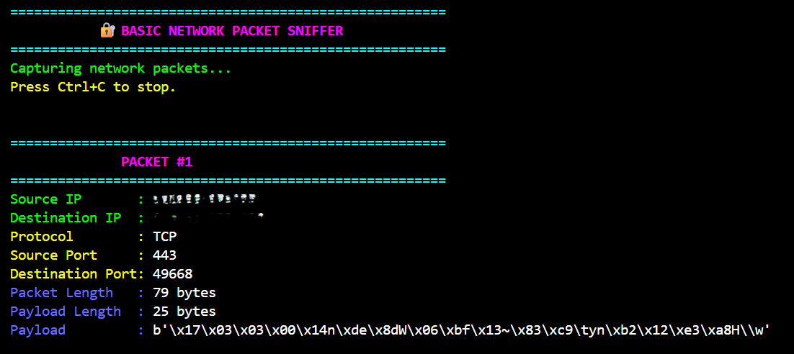
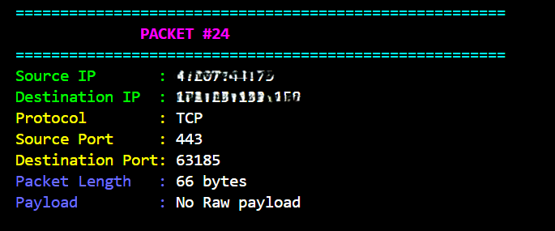
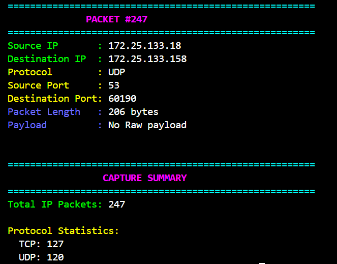

# Basic Network Packet Sniffer

A Python-based network packet sniffer developed as part of the **CodeAlpha Cyber Security Internship – Task 1**.

The project uses **Scapy** to capture and analyze IP network packets and displays useful information such as source and destination IP addresses, protocols, port numbers, packet length, and payload information.

## 🎯 Objective

* Capture network traffic packets using Python.
* Analyze the structure and basic content of captured packets.
* Understand how data flows through a network.
* Identify commonly used network protocols.
* Display useful packet information for analysis.

## 🛠️ Technologies & Libraries

* **Python** – Programming language
* **Scapy 2.7.0** – Packet capturing and analysis
* **VS Code** – Development environment
* **Npcap** – Windows packet capture support required by Scapy

## ✨ Features

* Captures live IP network packets.
* Displays source and destination IP addresses.
* Identifies TCP, UDP, ICMP and other IP protocols.
* Displays source and destination ports for TCP/UDP packets.
* Displays packet length.
* Detects and displays Raw payload information when available.
* Maintains protocol statistics.
* Displays a capture summary when packet capture is stopped.

## 📂 Project Structure

```text
CodeAlpha_BasicNetworkSniffer/
│
├── README.md
├── network_sniffer.py
├── requirements.txt
└── Screenshots/
    ├── packet_capture_1.png
    ├── packet_capture_2.png
    └── packet_capture_3.png
```

## ⚙️ Requirements & Setup

Make sure the following are installed:

* **Python 3**
* **Npcap** on Windows
* **Scapy 2.7.0**

Install the required dependency:

```bash
pip install -r requirements.txt
```

## ▶️ Running the Project

Open the project folder in **VS Code**, then run:

```bash
python network_sniffer.py
```

The program will start capturing and displaying IP network packets in the terminal.

Press **Ctrl + C** to stop packet capture and display the final capture summary.

## 📊 Packet Information Displayed

For each captured IP packet, the program can display:

* Packet number
* Source IP
* Destination IP
* Protocol
* Source port
* Destination port
* Packet length
* Payload length
* Payload data when available

## 📸 Screenshots

### Packet Capture – Start



### Packet Capture – Live Analysis



### Packet Capture – Summary



## 📚 Learning Outcomes

Through this project, I gained practical understanding of:

* Network packet capture and analysis
* IP addressing and packet flow
* TCP, UDP and ICMP protocols
* Source/destination ports
* Packet structure and payloads
* Basic network traffic monitoring using Python and Scapy

## 🏁 Conclusion

This project provided hands-on experience in capturing and analyzing live network traffic. It helped build a practical understanding of how packets travel through a network and how protocol and packet-level information can be used for basic network analysis.

---

[Click here to watch the Project Explanation on LinkedIn](https://lnkd.in/p/dE9vgvnF)

---

**CodeAlpha Cyber Security Internship — Task 1**
**Basic Network Sniffer**
